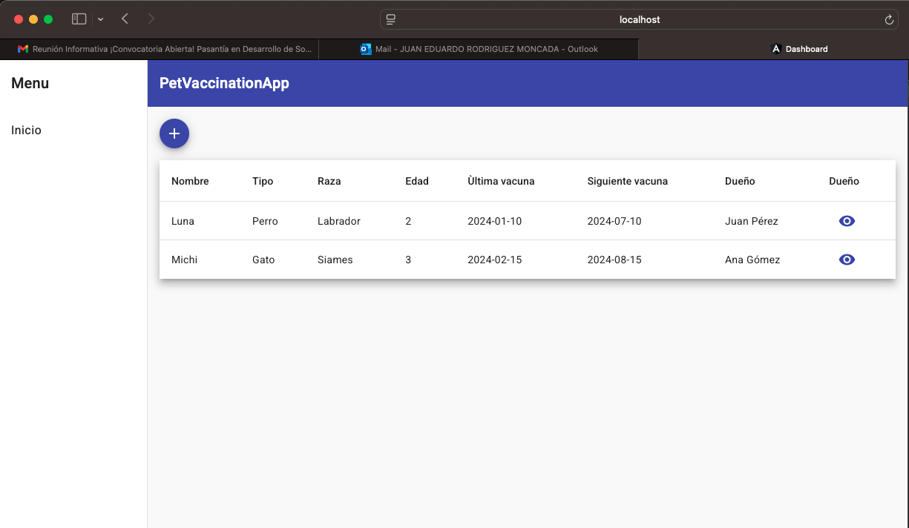
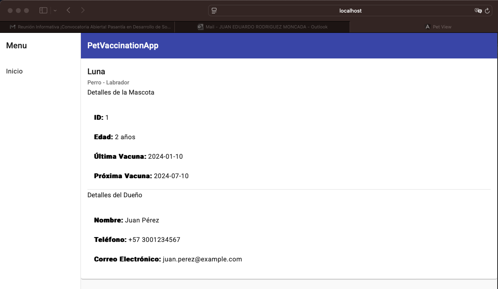

# PetVaccinationApp

This project was generated with [Angular CLI](https://github.com/angular/angular-cli) version 17.2.3.

## Descripción

PetVaccineTracker es una aplicación web diseñada para ayudar a los dueños de mascotas a gestionar y recordar el calendario de vacunación de sus animales. Con una interfaz amigable, permite registrar mascotas, programar vacunas

## Contributing

1. Usa la versión correcta de Node.js
`nvm use 20.11.1` Si usas nvm, o asegúrate de tener instalada la versión 20.11.1 de Node.js.
2. Instala las dependencias:
`npm i`
3. Ejecuta el proyecto:
`ng serve`

## Tecnologías utilizadas

Framework: Angular

Lenguaje: TypeScript

Gestión de paquetes: npm

Estilos: Css/AngularMaterial

## Control de cambios

El control de cambios en este proyecto se lleva en el archivo `changelog.md` y en el VERSION

## Arquitectura empleada

La estructura del proyecto se organiza en los siguientes directorios:

desk/: Contiene los componentes principales de la aplicación.
interface/: Define los modelos de datos e interfaces utilizados.
services/: Almacena todos los servicios empleados en la aplicación.
shared/: Incluye componentes reutilizables en diferentes partes de la aplicación.
assets/: Contiene archivos estáticos como imágenes, fuentes y archivos JSON de configuración.

## Diseño

Inicio de la aplicaciòn: muestra el menù de iniciò, donde se encuentra una tabla con la informaciòn de la vacunaciòn de mascotas

- Informaciòn de mascota: Permite ver la informaciòn detallada de una mascota en especifico.

- Botòn para agregar una nueva mascota al listado: Se encuentra en proceso de desarrollo para futuras versiones.

## Modelo de datos

Para este proyecto se hizo un mock de la respuesta del endpoint en un archivo .json alojado en los assets

## Build

Run `ng build` to build the project. The build artifacts will be stored in the `dist/` directory.

## Running unit tests

Run `ng test` to execute the unit tests via [Karma](https://karma-runner.github.io).

## Running end-to-end tests

Run `ng e2e` to execute the end-to-end tests via a platform of your choice. To use this command, you need to first add a package that implements end-to-end testing capabilities.

## Further help

To get more help on the Angular CLI use `ng help` or go check out the [Angular CLI Overview and Command Reference](https://angular.io/cli) page.
